# E-Commerce Web API: Architectural Masterclass & Deep Dive

> **Author / Principal Architect Reference Manual**  
> **Target Framework:** .NET 9 (C# 13) | Entity Framework Core 9  
> **Architectural Pattern:** Clean Architecture (Onion / Hexagonal Principles)  
> **Key Paradigms:** Unit of Work, Repository Pattern, Order Finite State Machine, Optimistic Concurrency Control, Refresh Token Rotation with Reuse Detection, RFC 7807 Problem Details.

---

## Table of Contents
1. [System Architecture & Layer Breakdown](#1-system-architecture--layer-breakdown)
   - [1.1 Clean Architecture Overview & Dependency Rule](#11-clean-architecture-overview--dependency-rule)
   - [1.2 Project & Layer Responsibilities](#12-project--layer-responsibilities)
   - [1.3 Architectural Case Study: The Dependency Inversion Principle (DIP)](#13-architectural-case-study-the-dependency-inversion-principle-dip)
2. [The Complete Request Pipeline (Internal System Flow)](#2-the-complete-request-pipeline-internal-system-flow)
   - [2.1 End-to-End HTTP Request Lifecycle](#21-end-to-end-http-request-lifecycle)
   - [2.2 Middleware Pipeline Execution Order](#22-middleware-pipeline-execution-order)
   - [2.3 Interception via FluentValidation](#23-interception-via-fluentvalidation)
   - [2.4 Standardized Response Models & RFC 7807 Problem Details](#24-standardized-response-models--rfc-7807-problem-details)
3. [Authentication & Authorization (AuthN vs. AuthZ)](#3-authentication--authorization-authn-vs-authz)
   - [3.1 JWT Architecture & Dual-Token Scheme](#31-jwt-architecture--dual-token-scheme)
   - [3.2 Refresh Token Rotation & Compromise Detection](#32-refresh-token-rotation--compromise-detection)
   - [3.3 Role-Based Access Control (RBAC)](#33-role-based-access-control-rbac)
   - [3.4 The 1:1 Cart Invariant & Frictionless Onboarding](#34-the-11-cart-invariant--frictionless-onboarding)
   - [3.5 Enterprise Security Controls: Rate Limiting & IDOR Prevention](#35-enterprise-security-controls-rate-limiting--idor-prevention)
4. [Comprehensive Endpoint Catalog (The "Why" and "How" for All 27 Endpoints)](#4-comprehensive-endpoint-catalog)
   - [4.1 Auth Controller (4 Endpoints)](#41-auth-controller)
   - [4.2 Categories Controller (5 Endpoints)](#42-categories-controller)
   - [4.3 Products Controller (7 Endpoints)](#43-products-controller)
   - [4.4 Cart Controller (5 Endpoints)](#44-cart-controller)
   - [4.5 Orders Controller (4 Endpoints)](#45-orders-controller)
   - [4.6 Admin Orders Controller (2 Endpoints)](#46-admin-orders-controller)
5. [Advanced Design Patterns & System Mechanisms](#5-advanced-design-patterns--system-mechanisms)
   - [5.1 Repository & Unit of Work Patterns](#51-repository--unit-of-work-patterns)
   - [5.2 High-Throughput Optimistic Concurrency Control (RowVersion)](#52-high-throughput-optimistic-concurrency-control-rowversion)
   - [5.3 Order Lifecycle State Machine](#53-order-lifecycle-state-machine)
   - [5.4 Global Query Filters & Automated Audit Tracking](#54-global-query-filters--automated-audit-tracking)

---

# 1. System Architecture & Layer Breakdown

## 1.1 Clean Architecture Overview & Dependency Rule

The solution is architected according to **Clean Architecture** (concentric onion layers), ensuring that business domain logic remains independent of database engines, UI frameworks, cloud platforms, and third-party libraries.

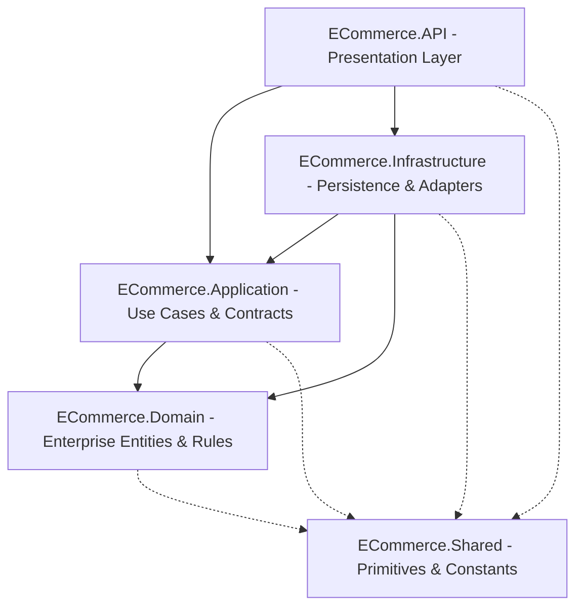

### The Core Invariant: The Dependency Rule
> **Dependencies MUST point inward.**  
> Outer layers (`API`, `Infrastructure`) know about inner layers (`Application`, `Domain`), but inner layers know **nothing** about outer layers. `ECommerce.Domain` has zero references to EF Core, ASP.NET Core, or SQL Server.

---

## 1.2 Project & Layer Responsibilities

```
src/
├── ECommerce.Domain/         # Core Enterprise Logic (Zero external dependencies)
├── ECommerce.Application/    # Orchestration, Business Services, DTOs, Validators, Mappings
├── ECommerce.Infrastructure/ # EF Core, Identity, Disk I/O, Repositories, DbContext
├── ECommerce.API/            # ASP.NET Core Host, Controllers, Middleware, DI Extensions
└── ECommerce.Shared/         # Universal Primitives (Result<T>, ApiResponse<T>, Constants)
```

### 1. `ECommerce.Domain`
- **Purpose**: Defines the enterprise data structures and pure business exceptions.
- **Key Artifacts**:
  - **Entities**: `Product`, `Category`, `ProductImage`, `Cart`, `CartItem`, `Order`, `OrderItem`, `Payment`, `ApplicationUser`, `RefreshToken`.
  - **Base Types**: `AuditableEntity` (provides `Id`, `CreatedAtUtc`, `UpdatedAtUtc`, `IsDeleted` soft delete flag).
  - **Enums**: `OrderStatus` (`Pending`, `Confirmed`, `Processing`, `Shipped`, `Delivered`, `Cancelled`), `PaymentStatus` (`Pending`, `Authorized`, `Succeeded`, `Failed`, `Refunded`).
  - **Domain Exceptions**: `NotFoundException`, `BadRequestException`, `ConflictException`, `InsufficientStockException`, `UnauthorizedException`.

### 2. `ECommerce.Application`
- **Purpose**: Defines **what** the system can do (Use Cases). Coordinates domain entities to fulfill business workflows.
- **Key Artifacts**:
  - **Interfaces**: `IRepository<T>`, `IUnitOfWork`, `ICategoryService`, `IProductService`, `ICartService`, `IOrderService`, `IAuthService`, `ITokenService`, `IJwtTokenGenerator`, `IFileStorageService`, `IPaymentService`.
  - **DTOs**: Immutable C# records for requests and responses (e.g., `CreateOrderDto`, `ProductDto`, `AuthResponse`).
  - **Service Implementations**: `CategoryService`, `ProductService`, `CartService`, `OrderService`.
  - **Validators**: FluentValidation rules validating input contracts.
  - **Mappings**: AutoMapper profile `MappingProfile`.

### 3. `ECommerce.Infrastructure`
- **Purpose**: Implements persistence, external integration, cryptographic generation, and file storage.
- **Key Artifacts**:
  - **Database Persistence**: `AppDbContext` (derives from `IdentityDbContext<ApplicationUser, IdentityRole<Guid>, Guid>`), Entity Configurations (`ProductConfiguration`, `OrderConfiguration`, etc.).
  - **Data Access Patterns**: Generic `Repository<T>`, transactional `UnitOfWork`.
  - **Identity & Auth Implementation**: `AuthService`, `TokenService`, `JwtTokenGenerator`.
  - **External Adapters**: `LocalFileStorageService` (disk I/O with validation), `MockPaymentService` (gateway simulator).
  - **Database Seeding**: `IdentitySeeder` (roles, system admin, 28 demo customers, 1:1 initial carts).

### 4. `ECommerce.API`
- **Purpose**: Web entry point. Exposes HTTP REST endpoints, handles serialization, rate limiting, authentication headers, and middleware error catching.
- **Key Artifacts**:
  - `Program.cs`: Minimal hosting model, middleware pipeline definition.
  - `Controllers`: `AuthController`, `CategoriesController`, `ProductsController`, `CartController`, `OrdersController`, `AdminOrdersController`.
  - `Middleware`: `ExceptionHandlingMiddleware` (transforms exceptions into RFC 7807 `ProblemDetails`).
  - `Extensions`: `DependencyInjection` (JWT authentication, CORS policy, fixed-window rate limiters, Swagger Bearer security).

### 5. `ECommerce.Shared`
- **Purpose**: Cross-cutting primitives and shared constants that can be referenced across all layers without violating Clean Architecture.
- **Key Artifacts**:
  - `Result<T>` and `Result`: Functional error-handling primitives.
  - `ApiResponse<T>` and `ApiResponse`: Standard API JSON wrappers.
  - `AppConstants`: Global constants for roles (`Admin`, `Customer`), CORS policies, Rate Limiting policies, and File Storage limits.

---

## 1.3 Architectural Case Study: The Dependency Inversion Principle (DIP)

### Question: Why is `OrderService` in Application, but `AuthService` is in Infrastructure?

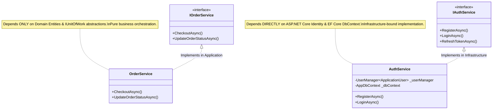

### The Architectural Rationale:
1. **`OrderService` has Pure Business Logic**:
   - Creating an order, calculating totals, verifying inventory, and enforcing the state machine transition matrix are **Enterprise Business Rules**.
   - `OrderService` interacts with the database solely through `IUnitOfWork` and `IRepository<T>` abstractions. It does not depend on SQL Server, EF Core, or any vendor-specific library. Therefore, its natural architectural home is `ECommerce.Application`.

2. **`AuthService` is Bound to Identity Infrastructure**:
   - ASP.NET Core Identity (`UserManager<ApplicationUser>`, `RoleManager<IdentityRole<Guid>>`) is a framework-level infrastructure concern.
   - Managing password hashing algorithms (PBKDF2), user security stamps, cryptographic token stores, and direct database queries for refresh token rotation requires infrastructure mechanisms.
   - The contract (`IAuthService`) resides in `ECommerce.Application` so controllers can inject it without knowing how authentication is performed. Its implementation (`AuthService`) lives in `ECommerce.Infrastructure`.

---

# 2. The Complete Request Pipeline (Internal System Flow)

## 2.1 End-to-End HTTP Request Lifecycle

When an HTTP client executes a request (e.g., `POST /api/orders/checkout`), the request traverses the complete internal pipeline illustrated below:

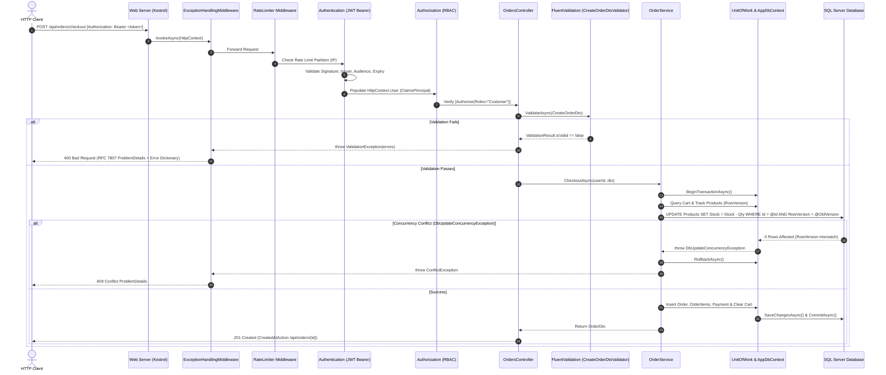

---

## 2.2 Middleware Pipeline Execution Order

The middleware order configured in `Program.cs` is mathematically crucial for security and fault tolerance:

```csharp
// Program.cs Execution Pipeline
app.UseMiddleware<ExceptionHandlingMiddleware>(); // 1. Global Error Shield
if (app.Environment.IsDevelopment())
{
    app.UseSwagger();                             // 2. OpenAPI Spec
    app.UseSwaggerUI(...);                        // 3. Interactive UI
}
else
{
    app.UseHsts();                                // 4. HTTP Strict Transport Security
}
app.UseHttpsRedirection();                       // 5. Force HTTPS
app.UseStaticFiles();                            // 6. Serve /uploads/products/*
app.UseCors(AppConstants.Cors.PolicyName);       // 7. CORS Headers
app.UseRateLimiter();                            // 8. IP Rate Limiting Throttler
app.UseAuthentication();                         // 9. Unpack & Validate JWT Token
app.UseAuthorization();                          // 10. Role & Policy Guard
app.MapControllers();                            // 11. Endpoint Dispatcher
```

### Why This Order Matters:
1. **`ExceptionHandlingMiddleware` at Position 1**:
   - Wraps the **entire execution tree** in a `try/catch` block.
   - Any exception thrown anywhere downstream (authentication errors, validation errors, database conflicts, uncaught runtime exceptions) is intercepted before Kestrel returns a raw 500 error.
2. **`UseRateLimiter` before `UseAuthentication`**:
   - Protects server CPU resources from expensive cryptographic JWT verification and database operations if an attacker floods the server with requests.
3. **`UseAuthentication` before `UseAuthorization`**:
   - You must establish **who** the user is (`ClaimsPrincipal`) before you can decide **what** they are permitted to do (`Roles = "Admin"`).

---

## 2.3 Interception via FluentValidation

Instead of relying on legacy ASP.NET `ModelState` filters, the system employs **explicit asynchronous validation** injected into controller actions:

```csharp
// Example in OrdersController.cs
var validationResult = await _createOrderValidator.ValidateAsync(request, cancellationToken);
if (!validationResult.IsValid)
    throw new ValidationException(validationResult.Errors);
```

### What Happens Behind the Scenes:
1. When `ValidationException` is thrown, normal execution halts immediately.
2. The exception bubbles up to `ExceptionHandlingMiddleware`.
3. The middleware groups errors by property name into a dictionary (`Dictionary<string, string[]>`) and embeds them into the standard RFC 7807 `ProblemDetails` response under the `errors` extension key.

---

## 2.4 Standardized Response Models & RFC 7807 Problem Details

The API adheres to international web standards for response formats:

### Success Responses:
Successful endpoints return typed HTTP status codes (`200 OK`, `201 Created`, `204 NoContent`) returning clean DTO models (or `ApiResponse<T>` wrappers):
```json
{
  "id": 14,
  "orderNumber": "ORD-20260909-3A9B2F",
  "totalAmount": 1499.98,
  "status": "Confirmed",
  "shippingAddress": "123 Nile Street, Zamalek, Cairo, Egypt",
  "createdAt": "2026-09-09T10:45:00Z",
  "items": [
    {
      "productId": 3,
      "productName": "Sony WH-1000XM5 Wireless Headphones",
      "unitPrice": 399.99,
      "quantity": 2,
      "totalPrice": 799.98
    }
  ]
}
```

### Error Responses (RFC 7807 `application/problem+json`):
Every exception is transformed into a standard RFC 7807 `ProblemDetails` object:
```json
{
  "type": "https://httpstatuses.com/400",
  "title": "Validation Failed",
  "status": 400,
  "detail": "One or more validation errors occurred.",
  "instance": "/api/orders/checkout",
  "traceId": "00-4bf92f3577b34da6a3ce929d0e0e4736-00f067aa0ba902b7-01",
  "errors": {
    "ShippingAddress": [
      "Shipping address must be at least 10 characters."
    ]
  }
}
```

### Middleware Exception Mapping Matrix:
| Exception Type | HTTP Status Code | RFC 7807 Title |
|---|---|---|
| `NotFoundException` | `404 Not Found` | "Resource Not Found" |
| `BadRequestException` | `400 Bad Request` | "Bad Request" |
| `ValidationException` | `400 Bad Request` | "Validation Failed" |
| `InsufficientStockException` | `409 Conflict` | "Stock Conflict" |
| `ConflictException` | `409 Conflict` | "Conflict" |
| `DbUpdateConcurrencyException` | `409 Conflict` | "Concurrency Conflict" |
| `UnauthorizedException` / `UnauthorizedAccessException` | `401 Unauthorized` | "Unauthorized" |
| Unhandled / General `Exception` | `500 Internal Server Error` | "Internal Server Error" |

---

# 3. Authentication & Authorization (AuthN vs. AuthZ)

## 3.1 JWT Architecture & Dual-Token Scheme

Authentication uses short-lived **JSON Web Tokens (Access Tokens)** and long-lived **Cryptographically Secure Refresh Tokens**.

```mermaid
graph LR
    subgraph Access Token (JWT)
        H[Header: HMAC SHA256]
        P[Payload: Sub, Email, Role, Jti, Name]
        S[Signature: Symmetric Security Key]
    end
    subgraph Refresh Token (Database Entity)
        T[64-Byte Cryptographic Random String]
        E[ExpiresAtUtc: 7 Days]
        R[RevokedAtUtc: Nullable DateTime]
        Replaced[ReplacedByToken: Nullable String]
    end
```

### 1. Access Token Generation (`TokenService.cs`):
- Signed with a 256-bit symmetric key (`HMAC-SHA256`).
- Embeds claims:
  - `sub` / `NameIdentifier`: `user.Id` (Guid).
  - `email`: `user.Email`.
  - `name`: `user.FullName`.
  - `role`: Role claims (`Admin` or `Customer`).
  - `jti`: Unique token identifier (`Guid.NewGuid()`).
- Expiration: Short-lived (e.g., 60 minutes).
- `ClockSkew` set to `TimeSpan.Zero` to guarantee strict token lifetime enforcement.

---

## 3.2 Refresh Token Rotation & Compromise Detection

To prevent replay attacks and stolen token reuse, the system implements **Refresh Token Rotation with Automatic Reuse Detection and a 15-second Grace Period**:

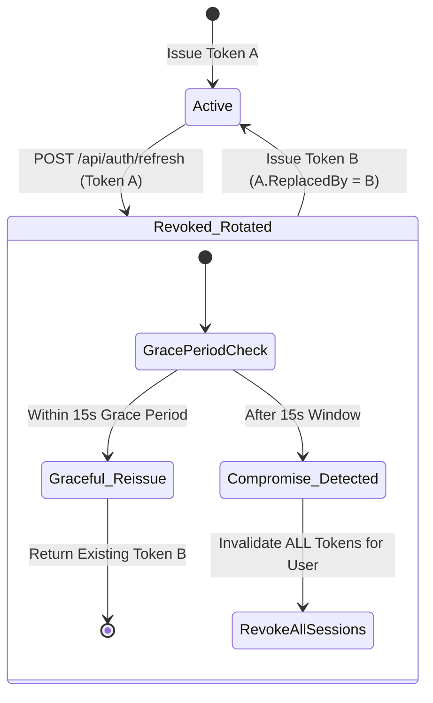

### How Compromise Detection Protects Users:
1. When a client presents an active refresh token, the server marks it as `RevokedAtUtc = DateTime.UtcNow`, records `ReplacedByToken = newToken.Token`, and issues a new pair.
2. If network latency causes a mobile client to resend the same token within **15 seconds**, the server recognizes the transient retry and safely re-returns the replacement token.
3. If an attacker attempts to use a revoked refresh token **after** 15 seconds:
   - The server detects a token theft / replay attack.
   - The server immediately queries all active refresh tokens belonging to that `UserId` and marks them **all as revoked**.
   - Throws `UnauthorizedException("Compromised refresh token detected. All active sessions have been revoked.")`.

---

## 3.3 Role-Based Access Control (RBAC)

The system defines two primary operational roles:

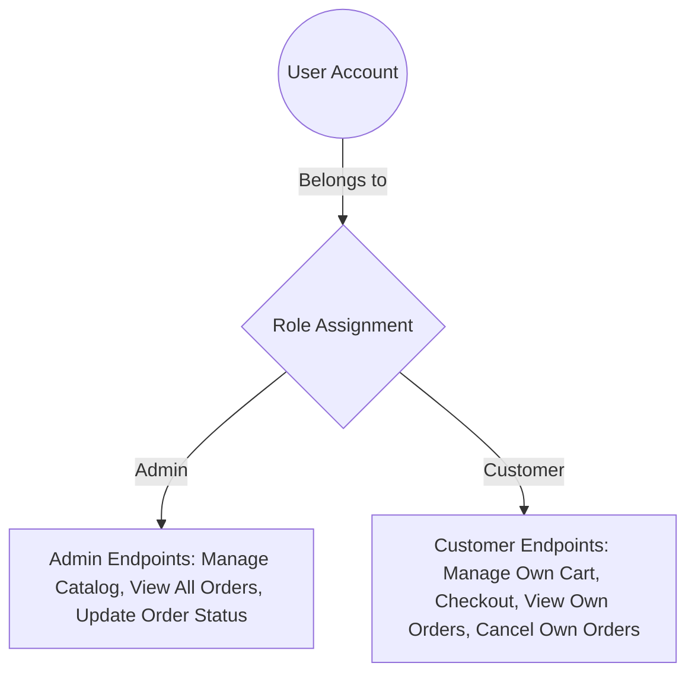

- **`Admin`**:
  - Full CRUD on Categories (`POST /api/categories`, `PUT`, `DELETE`).
  - Full CRUD & Image Upload on Products (`POST /api/products`, `PUT`, `DELETE`, `POST /images`, `DELETE /images`).
  - Global Order Inspection & State Machine Transition (`GET /api/admin/orders`, `PUT /api/admin/orders/{id}/status`).
- **`Customer`**:
  - Personal Cart Management (`GET /api/cart`, `POST /items`, `PUT /items/{productId}`, `DELETE /items/{productId}`, `DELETE /cart`).
  - Personal Checkout (`POST /api/orders/checkout`).
  - Personal Order History (`GET /api/orders`, `GET /api/orders/{id}`).
  - Order Self-Cancellation (`POST /api/orders/{id}/cancel`).

---

## 3.4 The 1:1 Cart Invariant & Frictionless Onboarding

### The Architectural Problem:
In naive e-commerce systems, user registration and shopping cart creation are separated. This leads to null-reference exceptions, multiple competing active carts, and race conditions during simultaneous logins across mobile and web.

### The Solution in this Architecture:
1. **Atomic Cart Provisioning**:
   During `AuthService.RegisterAsync` (and inside `IdentitySeeder.cs`), the moment a `Customer` account is created, a dedicated `Cart` entity is created with `UserId = user.Id` in the exact same transaction:
   ```csharp
   var cart = new Cart { UserId = user.Id };
   _dbContext.Set<Cart>().Add(cart);
   await _dbContext.SaveChangesAsync();
   ```
2. **Frictionless Auto-Login UX**:
   Upon registration, the client does not need to execute a secondary login request. `RegisterAsync` automatically generates and returns the `AuthResponse` (Access Token + Refresh Token) and appends the secure `HttpOnly` refresh cookie.

---

## 3.5 Enterprise Security Controls: Rate Limiting & IDOR Prevention

### 1. Multi-Tiered IP Rate Limiting (`DependencyInjection.cs`)
Using .NET 9 `Microsoft.AspNetCore.RateLimiting`:
- **`StrictAuthRateLimit` Policy**:
  - Allocated to `POST /api/auth/login` and `POST /api/auth/register`.
  - **10 requests per minute** per Remote IP. Thwarts dictionary and credential stuffing attacks.
- **`AuthRateLimit` Policy**:
  - Allocated to `POST /api/auth/refresh`.
  - **100 requests per minute** per Remote IP. Allows legitimate application token refreshes while throttling automated scrapers.

### 2. IDOR (Insecure Direct Object Reference) Prevention
A critical vulnerability in e-commerce occurs when User A accesses User B's order by changing the URL parameter `/api/orders/123`.

**How We Prevent IDOR**:
1. **Never trust client-supplied user IDs**: User identification is extracted exclusively from the cryptographically verified JWT claim:
   ```csharp
   var userIdClaim = User.FindFirstValue(ClaimTypes.NameIdentifier);
   var userId = Guid.Parse(userIdClaim);
   ```
2. **Enforce Tenant Ownership in SQL Queries**:
   ```csharp
   var order = await _unitOfWork.Orders.Query()
       .AsNoTracking()
       .Include(o => o.Items)
       .FirstOrDefaultAsync(o => o.Id == orderId && o.UserId == userId, cancellationToken);
   
   if (order == null)
       throw new NotFoundException($"Order with ID {orderId} was not found.");
   ```
3. **Return 404 Not Found (Never 403 Forbidden)**:
   Returning `403 Forbidden` confirms to an attacker that the order exists. Returning `404 Not Found` completely blinds the attacker from enumerating valid order IDs.

---

# 4. Comprehensive Endpoint Catalog

Below is the complete, exhaustive catalog of all **27 endpoints** implemented across the 6 controllers in `src/ECommerce.API/Controllers/`.

---

## 4.1 Auth Controller
`Route: api/auth`

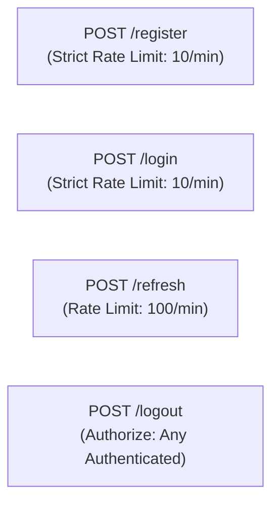

### 1. `POST /api/auth/register`
- **Security / Rate Limit**: `[AllowAnonymous]`, `StrictAuthRateLimit` (10 req/min).
- **Business Purpose**: Registers a new customer account, automatically provisions their 1:1 shopping cart, assigns the `Customer` role, and executes an immediate auto-login.
- **Request DTO**: `RegisterRequest` (`FullName`, `Email`, `Password`, `ConfirmPassword`).
- **Response DTO**: `AuthResponse` (`AccessToken`, `RefreshToken`, `RefreshTokenExpiresOn`, `FullName`, `Email`, `Roles`).
- **Validation Rules (`RegisterRequestValidator`)**:
  - `FullName`: Required, 3 to 100 characters.
  - `Email`: Required, valid email format, max 150 characters.
  - `Password`: Required, minimum 8 characters, at least 1 uppercase, 1 lowercase, 1 digit, 1 special character.
  - `ConfirmPassword`: Must match `Password`.
- **Internal Service Flow**:
  1. Checks if email already exists via `UserManager.FindByEmailAsync`. Throws `ConflictException` (409) if duplicate.
  2. Creates `ApplicationUser` entity with password hash.
  3. Ensures `Customer` role exists and assigns user to role.
  4. Inserts new `Cart` with `UserId = user.Id`.
  5. Generates JWT Access Token and 64-byte Refresh Token.
  6. Sets secure `HttpOnly` refresh cookie on HTTP response.

---

### 2. `POST /api/auth/login`
- **Security / Rate Limit**: `[AllowAnonymous]`, `StrictAuthRateLimit` (10 req/min).
- **Business Purpose**: Authenticates an existing user and issues fresh access and refresh tokens.
- **Request DTO**: `LoginRequest` (`Email`, `Password`).
- **Response DTO**: `AuthResponse`.
- **Validation Rules (`LoginRequestValidator`)**:
  - `Email`: Required, valid email format.
  - `Password`: Required.
- **Internal Service Flow**:
  1. Queries user by email.
  2. Verifies password hash via `UserManager.CheckPasswordAsync`. Throws `UnauthorizedException` (401) on failure.
  3. Queries roles assigned to user.
  4. Generates JWT Access Token containing user claims and roles.
  5. Generates and persists new `RefreshToken` entity.
  6. Appends `HttpOnly` cookie and returns `AuthResponse`.

---

### 3. `POST /api/auth/refresh`
- **Security / Rate Limit**: `[AllowAnonymous]`, `AuthRateLimit` (100 req/min).
- **Business Purpose**: Rotates an expiring access token using a valid refresh token supplied either via JSON request body or `HttpOnly` cookie.
- **Request DTO**: `RefreshTokenRequest` (`RefreshToken`). Can be empty body if cookie is present.
- **Response DTO**: `AuthResponse`.
- **Validation Rules (`RefreshTokenRequestValidator`)**:
  - `RefreshToken`: Required, non-empty string.
- **Internal Service Flow**:
  1. Resolves token from body or `Request.Cookies["refreshToken"]`. Throws `UnauthorizedException` if missing.
  2. Queries `RefreshToken` entity from database including navigation `User`.
  3. If token is revoked:
     - Checks 15-second grace period. If within grace period, returns existing active replacement token.
     - If outside grace period: **Compromise detected!** Invalidate all active tokens for that user and throw `UnauthorizedException`.
  4. If token is expired (`ExpiresAtUtc <= UtcNow`), throws `UnauthorizedException`.
  5. Generates new `RefreshToken`, marks old token as `RevokedAtUtc = UtcNow` with `ReplacedByToken = newToken.Token`.
  6. Generates new JWT Access Token and updates response cookie.

---

### 4. `POST /api/auth/logout`
- **Security**: `[Authorize]`.
- **Business Purpose**: Securely revokes the current refresh token and purges the authentication cookie.
- **Request DTO**: `RefreshTokenRequest` (optional body or read from cookie).
- **Response**: `204 No Content`.
- **Internal Service Flow**:
  1. Extracts refresh token from request body or cookie.
  2. If token exists and is active, updates `RevokedAtUtc = DateTime.UtcNow`.
  3. Deletes `refreshToken` cookie by setting expired deletion headers (`SameSite=Strict`, `HttpOnly=true`, `Secure=true`).

---

## 4.2 Categories Controller
`Route: api/categories`

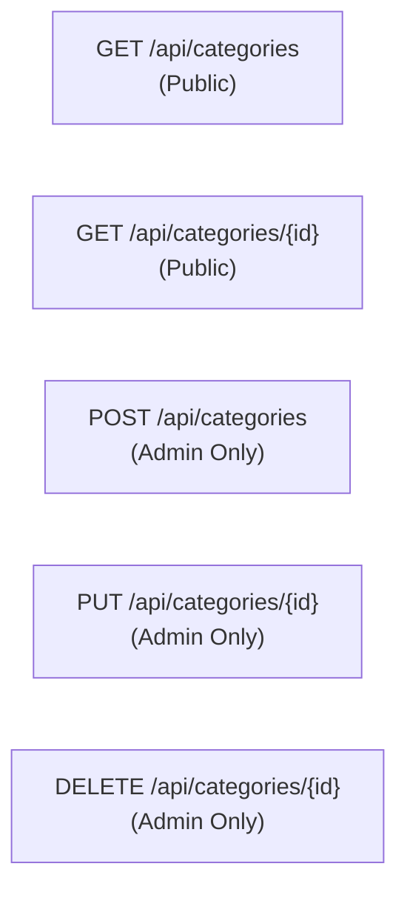

### 5. `GET /api/categories`
- **Security**: `[AllowAnonymous]`.
- **Business Purpose**: Retrieves the full catalog category hierarchy for navigation menus and filtering.
- **Response**: `IReadOnlyList<CategoryDto>` (`Id`, `Name`, `Description`).
- **Internal Flow**: Queries `AppDbContext.Categories` with `.AsNoTracking()`, projecting directly into `CategoryDto`.

---

### 6. `GET /api/categories/{id}`
- **Security**: `[AllowAnonymous]`.
- **Business Purpose**: Retrieves full details of a specific category by its primary key ID.
- **Response**: `CategoryDto`.
- **Internal Flow**: Queries category by ID with `.AsNoTracking()`. Throws `NotFoundException` (404) if not found.

---

### 7. `POST /api/categories`
- **Security**: `[Authorize(Roles = "Admin")]`.
- **Business Purpose**: Allows store administrators to create a new product category.
- **Request DTO**: `CategoryCreateDto` (`Name`, `Description`).
- **Response**: `201 Created` with `CategoryDto` and `Location` header pointing to `GET /api/categories/{id}`.
- **Validation Rules (`CategoryCreateDtoValidator`)**:
  - `Name`: Required, 2 to 100 characters.
  - `Description`: Max 500 characters.
- **Internal Flow**: Checks for unique category name. Throws `ConflictException` (409) if duplicate. Adds entity and persists via `UnitOfWork.SaveChangesAsync()`.

---

### 8. `PUT /api/categories/{id}`
- **Security**: `[Authorize(Roles = "Admin")]`.
- **Business Purpose**: Updates the name and description of an existing category.
- **Request DTO**: `CategoryUpdateDto` (`Name`, `Description`).
- **Response**: `200 OK` with `CategoryDto`.
- **Validation Rules (`CategoryUpdateDtoValidator`)**:
  - `Name`: Required, 2 to 100 characters.
  - `Description`: Max 500 characters.
- **Internal Flow**: Verifies category exists (throws 404). Checks name uniqueness against other category records (throws 409). Updates tracked entity and saves changes.

---

### 9. `DELETE /api/categories/{id}`
- **Security**: `[Authorize(Roles = "Admin")]`.
- **Business Purpose**: Deletes an unused category.
- **Response**: `204 No Content`.
- **Internal Flow**: Verifies category exists. Checks if any products are associated with `CategoryId == id`. If products exist, **aborts deletion** and throws `ConflictException` (409) to preserve referential integrity. Soft-deletes category if no products are attached.

---

## 4.3 Products Controller
`Route: api/products`

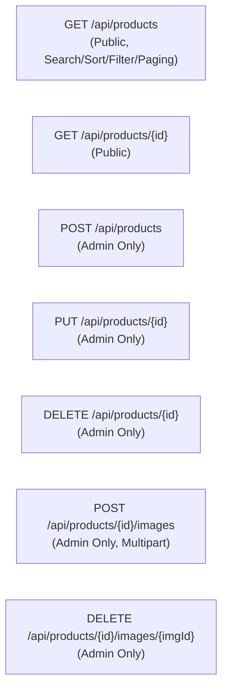

### 10. `GET /api/products`
- **Security**: `[AllowAnonymous]`.
- **Business Purpose**: Powers the catalog storefront search, filtering, price range, stock availability, multi-column sorting, and pagination.
- **Query Parameters (`ProductQueryParameters`)**:
  - `SearchTerm` (string): Case-insensitive match on product `Name` or `Description`.
  - `CategoryId` (int?): Filter by specific category.
  - `MinPrice` / `MaxPrice` (decimal?): Price boundary filtering.
  - `InStockOnly` (bool?): If true, returns only items where `StockQuantity > 0`.
  - `SortBy` (string): Sort column (`"price"`, `"newest"`, `"name"`).
  - `Descending` (bool): Sort direction.
  - `PageNumber` (int, default 1), `PageSize` (int, default 10, max 50).
- **Response**: `PagedResult<ProductDto>` (`Items`, `TotalCount`, `PageNumber`, `PageSize`, `TotalPages`, `HasPreviousPage`, `HasNextPage`).
- **Validation Rules (`ProductQueryParametersValidator`)**:
  - `PageNumber` >= 1; `PageSize` between 1 and 50.
  - `MinPrice` >= 0; `MaxPrice` >= `MinPrice`.
- **Internal Flow**: Constructs dynamic `IQueryable<Product>` using `.AsNoTracking()`, executes `CountAsync()` for metadata, applies `Skip().Take()`, and projects images sorted by `DisplayOrder`.

---

### 11. `GET /api/products/{id}`
- **Security**: `[AllowAnonymous]`.
- **Business Purpose**: Retrieves detailed product information, category name, and all image URLs for a product details page.
- **Response**: `ProductDto`.
- **Internal Flow**: Queries product with `.AsNoTracking()`. Throws `NotFoundException` (404) if not found.

---

### 12. `POST /api/products`
- **Security**: `[Authorize(Roles = "Admin")]`.
- **Business Purpose**: Creates a new product catalog item with automated URL-friendly slug generation.
- **Request DTO**: `ProductCreateDto` (`Name`, `Description`, `Price`, `StockQuantity`, `SKU`, `CategoryId`).
- **Response**: `201 Created` with `ProductDto`.
- **Validation Rules (`ProductCreateDtoValidator`)**:
  - `Name`: Required, 2 to 150 characters.
  - `Description`: Required, max 4000 characters.
  - `Price`: > 0, max 2 decimal places.
  - `StockQuantity`: >= 0.
  - `SKU`: Required, alphanumeric, max 50 characters.
  - `CategoryId`: > 0.
- **Internal Flow**:
  1. Validates that `CategoryId` exists in DB (throws 404 if invalid).
  2. Validates that `SKU` is globally unique (throws 409 if duplicate).
  3. Generates sanitized URL slug (e.g. `"iPhone 16 Pro Max"` -> `"iphone-16-pro-max"`).
  4. Saves entity and returns `CreatedAtAction`.

---

### 13. `PUT /api/products/{id}`
- **Security**: `[Authorize(Roles = "Admin")]`.
- **Business Purpose**: Updates product specifications, pricing, stock levels, or category assignment.
- **Request DTO**: `ProductUpdateDto`.
- **Response**: `200 OK` with `ProductDto`.
- **Validation Rules (`ProductUpdateDtoValidator`)**: Matches create rules.
- **Internal Flow**: Verifies product existence, validates category existence, validates SKU uniqueness against other records, updates entity, regenerates slug, and persists changes.

---

### 14. `DELETE /api/products/{id}`
- **Security**: `[Authorize(Roles = "Admin")]`.
- **Business Purpose**: Removes a product from the catalog (triggers soft delete).
- **Response**: `204 No Content`.
- **Internal Flow**: Finds product by ID (throws 404 if not found). Calls `_unitOfWork.Products.Remove(product)`. `AppDbContext` sets `IsDeleted = true` and updates `UpdatedAtUtc`.

---

### 15. `POST /api/products/{id}/images`
- **Security**: `[Authorize(Roles = "Admin")]`, `Consumes("multipart/form-data")`.
- **Business Purpose**: Uploads and attaches a product image to the catalog item.
- **Payload**: `IFormFile file` (multipart/form-data).
- **Response**: `201 Created` with `ProductImageDto` (`Id`, `ImageUrl`, `IsPrimary`, `DisplayOrder`, `ProductId`).
- **Validations**:
  - File presence and non-zero length.
  - Max file size limit: **5 MB** (`AppConstants.FileStorage.MaxFileSizeInBytes`).
  - Allowed extensions: `.jpg`, `.jpeg`, `.png`, `.webp`.
- **Internal Flow**:
  1. Verifies product exists.
  2. Generates unique GUID file name and saves stream asynchronously to `/wwwroot/uploads/products/{guid}.ext`.
  3. Calculates existing image count for this product.
  4. If first image, marks `IsPrimary = true`; assigns `DisplayOrder = count + 1`.
  5. Inserts `ProductImage` entity into database.

---

### 16. `DELETE /api/products/{id}/images/{imageId}`
- **Security**: `[Authorize(Roles = "Admin")]`.
- **Business Purpose**: Deletes a specific product image from both disk storage and database.
- **Response**: `204 No Content`.
- **Internal Flow**: Verifies product existence and image existence. Deletes physical file from `wwwroot/uploads/products/` via `LocalFileStorageService`. Removes `ProductImage` entity from database.

---

## 4.4 Cart Controller
`Route: api/cart`

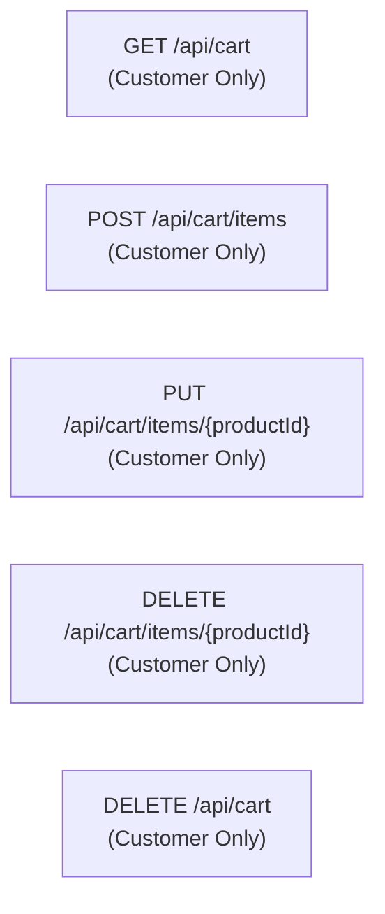

### 17. `GET /api/cart`
- **Security**: `[Authorize(Roles = "Customer")]`.
- **Business Purpose**: Retrieves the current authenticated customer's shopping cart, item line totals, subtotal, and real-time product price change flags.
- **Response**: `CartDto` (`Id`, `Items`, `Subtotal`).
- **Internal Flow**:
  1. Resolves `UserId` from JWT claim.
  2. Retrieves cart including `Items`, `Product`, and `ProductImages`.
  3. Compares `UnitPriceSnapshot` with current `Product.Price` to detect if the merchant changed the price while the item sat in the cart (`HasPriceChanged = true`).
  4. Computes subtotal and returns `CartDto`.

---

### 18. `POST /api/cart/items`
- **Security**: `[Authorize(Roles = "Customer")]`.
- **Business Purpose**: Adds an item to the shopping cart or increments the quantity if already present.
- **Request DTO**: `AddCartItemDto` (`ProductId`, `Quantity`).
- **Response**: `200 OK` with updated `CartDto`.
- **Validation Rules (`AddCartItemDtoValidator`)**:
  - `ProductId`: > 0.
  - `Quantity`: between 1 and 100.
- **Internal Flow**:
  1. Validates product existence in database (throws 404).
  2. Resolves customer cart.
  3. Checks total quantity (`existingQuantity + requestedQuantity`) against available `product.StockQuantity`.
  4. If stock is exceeded, throws `ConflictException` (409).
  5. Either updates existing `CartItem.Quantity` or creates a new `CartItem` with `UnitPriceSnapshot = product.Price`.
  6. Saves changes and returns updated cart.

---

### 19. `PUT /api/cart/items/{productId}`
- **Security**: `[Authorize(Roles = "Customer")]`.
- **Business Purpose**: Adjusts the exact quantity of a specific item inside the customer's cart.
- **Request DTO**: `UpdateCartItemDto` (`Quantity`).
- **Response**: `200 OK` with updated `CartDto`.
- **Validation Rules (`UpdateCartItemDtoValidator`)**:
  - `Quantity`: between 1 and 100.
- **Internal Flow**: Verifies item exists in customer cart (throws 404). Verifies requested quantity does not exceed product stock (throws 409). Updates `Quantity`, persists, and returns updated cart.

---

### 20. `DELETE /api/cart/items/{productId}`
- **Security**: `[Authorize(Roles = "Customer")]`.
- **Business Purpose**: Removes a specific product line item from the shopping cart.
- **Response**: `200 OK` with updated `CartDto`.
- **Internal Flow**: Finds line item in cart (throws 404 if missing). Removes item from collection, persists changes, and returns updated cart.

---

### 21. `DELETE /api/cart`
- **Security**: `[Authorize(Roles = "Customer")]`.
- **Business Purpose**: Clears all line items from the customer's cart.
- **Response**: `204 No Content`.
- **Internal Flow**: Clears all items in `cart.Items`, calls `SaveChangesAsync()`, and returns 204.

---

## 4.5 Orders Controller
`Route: api/orders`

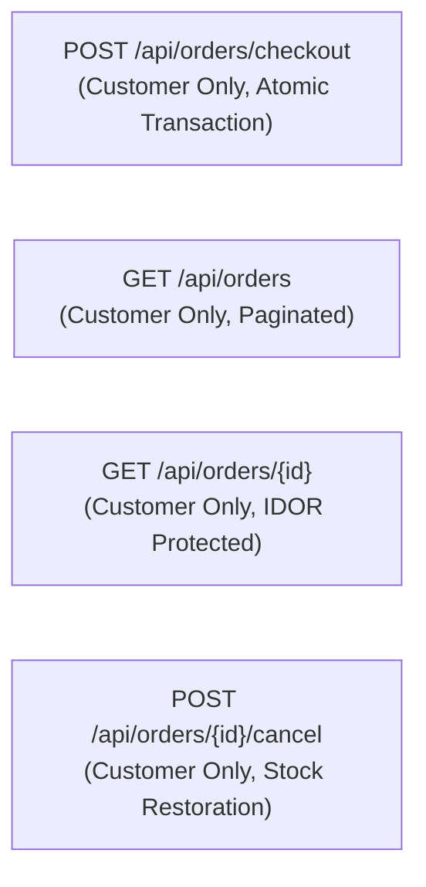

### 22. `POST /api/orders/checkout`
- **Security**: `[Authorize(Roles = "Customer")]`.
- **Business Purpose**: Executes the mission-critical checkout transaction: locks stock, authorizes payment, generates immutable order record, clears cart, and commits atomically.
- **Request DTO**: `CreateOrderDto` (`ShippingAddress`).
- **Response**: `201 Created` with `OrderDto`.
- **Validation Rules (`CreateOrderDtoValidator`)**:
  - `ShippingAddress`: Required, 10 to 500 characters.
- **Internal Service Flow**:
  1. Retrieves customer's cart with items. Throws `BadRequestException` (400) if cart is empty.
  2. Wraps the checkout in an **EF Core Execution Strategy** and begins an atomic database transaction (`BeginTransactionAsync`).
  3. **Stock Verification & RowVersion Tracking**:
     - Loops over cart items, loads each `Product`.
     - Validates `product.StockQuantity >= item.Quantity` (throws `InsufficientStockException` if out of stock).
     - Decrements `product.StockQuantity -= item.Quantity`.
     - Captures immutable price snapshots (`product.Price`, `product.Name`).
  4. **Payment Gateway Authorization**: Calls `IPaymentService.AuthorizePaymentAsync(totalAmount)`. Throws 400 if payment is declined.
  5. **Order & Payment Entity Creation**: Generates unique business order number (`ORD-yyyyMMdd-XXXXXX`), links payment record (`PaymentStatus.Succeeded`), and sets order status to `OrderStatus.Confirmed`.
  6. **Cart Eviction**: Removes all items from the customer's cart.
  7. **Atomic Commit**: Calls `SaveChangesAsync()` and `transaction.CommitAsync()`.
  8. If another transaction modified stock concurrently, EF Core throws `DbUpdateConcurrencyException`, transaction rolls back, and service throws `ConflictException` (409).

---

### 23. `GET /api/orders`
- **Security**: `[Authorize(Roles = "Customer")]`.
- **Business Purpose**: Retrieves paginated order history for the authenticated customer.
- **Query Parameters**: `pageNumber` (int, default 1), `pageSize` (int, default 10).
- **Response**: `PagedResult<OrderDto>`.
- **Internal Flow**: Queries orders filtered strictly by `UserId == currentUserId`, ordered by `CreatedAtUtc DESC`, paginated, and projected to `OrderDto`.

---

### 24. `GET /api/orders/{id}`
- **Security**: `[Authorize(Roles = "Customer")]`.
- **Business Purpose**: Retrieves full order invoice details for a specific order.
- **Response**: `OrderDto`.
- **Internal Flow**:
  - Queries order with criteria: `o.Id == id && o.UserId == currentUserId`.
  - **IDOR Protection**: If order does not exist OR belongs to another customer, throws `NotFoundException` (404).

---

### 25. `POST /api/orders/{id}/cancel`
- **Security**: `[Authorize(Roles = "Customer")]`.
- **Business Purpose**: Allows a customer to cancel their order if it has not yet begun warehouse processing, automatically restoring product stock.
- **Response**: `200 OK` with updated `OrderDto`.
- **Internal Flow**:
  1. Queries order verifying tenant ownership (`UserId == currentUserId`). Throws 404 if missing.
  2. Validates that current status is **`Pending`** or **`Confirmed`**. If status is `Processing`, `Shipped`, or `Delivered`, throws `BadRequestException` (400) ("Orders in 'Processing' status cannot be cancelled").
  3. Executes atomic transaction:
     - For every `OrderItem`, increments `product.StockQuantity += item.Quantity`.
     - Sets `order.Status = OrderStatus.Cancelled`.
     - Commits transaction and returns updated order.

---

## 4.6 Admin Orders Controller
`Route: api/admin/orders`

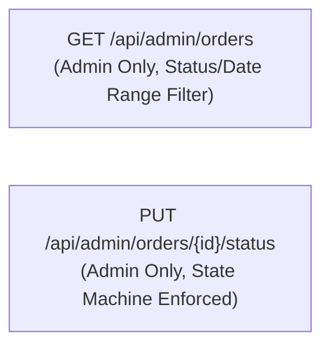

### 26. `GET /api/admin/orders`
- **Security**: `[Authorize(Roles = "Admin")]`.
- **Business Purpose**: Administrative dashboard endpoint to filter, inspect, and paginate all customer orders across the entire platform.
- **Query Parameters (`OrderQueryParameters`)**:
  - `Status` (`OrderStatus`?): Filter by status (`Pending`, `Confirmed`, `Processing`, `Shipped`, `Delivered`, `Cancelled`).
  - `FromDateUtc` / `ToDateUtc` (DateTime?): Date range filtering.
  - `PageNumber` (int, default 1), `PageSize` (int, default 10).
- **Response**: `PagedResult<OrderDto>`.
- **Validation Rules (`OrderQueryParametersValidator`)**:
  - `PageNumber` >= 1; `PageSize` between 1 and 50.
  - `ToDateUtc` must be >= `FromDateUtc`.
- **Internal Flow**: Queries all orders with optional status and date filters, ordered by `CreatedAtUtc DESC`, paginated, and projected to DTOs.

---

### 27. `PUT /api/admin/orders/{id}/status`
- **Security**: `[Authorize(Roles = "Admin")]`.
- **Business Purpose**: Updates an order's lifecycle status while strictly enforcing the domain state machine transition matrix.
- **Request DTO**: `OrderStatusUpdateDto` (`Status`).
- **Response**: `200 OK` with updated `OrderDto`.
- **Validation Rules (`OrderStatusUpdateDtoValidator`)**:
  - `Status`: Valid `OrderStatus` enum value.
- **Internal Flow**:
  1. Finds order by ID (throws 404 if missing).
  2. If `order.Status == request.Status`, returns immediately (idempotent).
  3. **State Machine Validation**: Calls `ValidateStatusTransition(order.Status, request.Status)`. Throws `BadRequestException` (400) if transition is illegal.
  4. If status changes to `Cancelled`:
     - Executes atomic transaction restoring product stock for each line item.
     - Sets status to `Cancelled` and commits.
  5. Otherwise, updates status to target state (`Processing`, `Shipped`, `Delivered`) and saves changes.

---

# 5. Advanced Design Patterns & System Mechanisms

## 5.1 Repository & Unit of Work Patterns

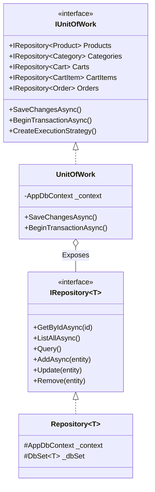

### Why Repository + Unit of Work is used over raw DbContext:
1. **Transaction Boundary Coordination**:
   A single business operation (such as `OrderService.CheckoutAsync`) modifies multiple aggregates: decrements `Products` stock, creates `Orders`, creates `OrderItems`, creates `Payments`, and removes `CartItems`. The `UnitOfWork` ensures all these operations share a single `AppDbContext` and commit atomically in one database roundtrip.
2. **Execution Strategy & Resiliency**:
   `UnitOfWork` exposes `CreateExecutionStrategy()`, enabling SQL Server retry logic on transient network failures without corrupting manual transactions.
3. **Decoupling Business Logic**:
   Business services depend on `IUnitOfWork` and `IRepository<T>` abstractions, facilitating isolated unit testing with mocks.

---

## 5.2 High-Throughput Optimistic Concurrency Control (RowVersion)

### The Problem: The High-Concurrency Flash Sale Race Condition
Consider two shoppers, Alice and Bob, simultaneously checking out the last remaining iPhone (`StockQuantity = 1`).

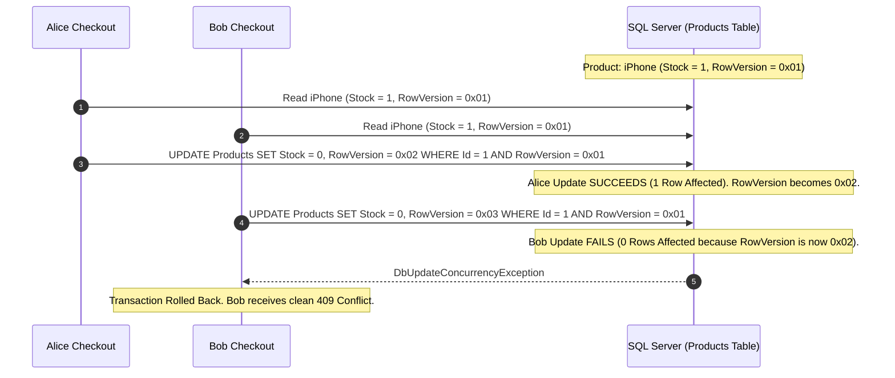

### The Implementation:
1. **Domain Entity (`Product.cs`)**:
   ```csharp
   public byte[] RowVersion { get; set; } = [];
   ```
2. **EF Core Fluent Configuration (`ProductConfiguration.cs`)**:
   ```csharp
   builder.Property(p => p.RowVersion)
          .IsRowVersion(); // Configures SQL Server [timestamp]/[rowversion] column
   ```
3. **Optimistic Concurrency Handling (`OrderService.cs`)**:
   ```csharp
   try
   {
       // Stock deduction and checkout logic
       await _unitOfWork.SaveChangesAsync(cancellationToken);
       await transaction.CommitAsync(cancellationToken);
   }
   catch (DbUpdateConcurrencyException)
   {
       await transaction.RollbackAsync(cancellationToken);
       throw new ConflictException("One or more items in your cart were modified concurrently. Please review your cart and retry.");
   }
   ```
4. **Why Optimistic > Pessimistic Locking**:
   Pessimistic locking (`SELECT FOR UPDATE`) places exclusive locks on database rows, destroying throughput and causing deadlocks. Optimistic Concurrency allows lock-free reads and detects conflicts only at write time, delivering maximum scalability.

---

## 5.3 Order Lifecycle State Machine

The order lifecycle is governed by a **Finite State Machine (FSM)**. State transitions are verified by a strict transition matrix:

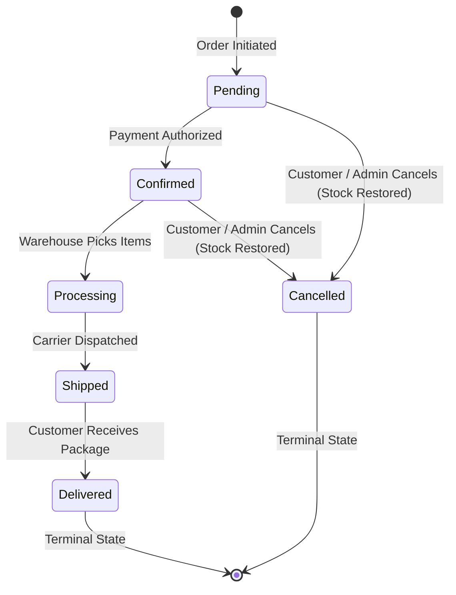

### The Transition Validation Matrix (`OrderService.cs`):
```csharp
private static void ValidateStatusTransition(OrderStatus current, OrderStatus requested)
{
    var isValid = (current, requested) switch
    {
        (OrderStatus.Pending, OrderStatus.Confirmed)    => true,
        (OrderStatus.Pending, OrderStatus.Cancelled)    => true,
        (OrderStatus.Confirmed, OrderStatus.Processing) => true,
        (OrderStatus.Confirmed, OrderStatus.Cancelled)  => true,
        (OrderStatus.Processing, OrderStatus.Shipped)   => true,
        (OrderStatus.Shipped, OrderStatus.Delivered)   => true,
        _ => false
    };

    if (!isValid)
    {
        throw new BadRequestException(
            $"Invalid order status transition from '{current}' to '{requested}'. " +
            "Allowed lifecycle: Pending -> Confirmed -> Processing -> Shipped -> Delivered " +
            "(or Cancelled from Pending/Confirmed).");
    }
}
```

### Key Business Invariants:
1. **Stock Restoration**: When an order transitions to `Cancelled`, the system automatically increments `StockQuantity` for every line item inside an atomic transaction.
2. **Terminal States**: `Delivered` and `Cancelled` are terminal states. No further status changes are permitted once an order reaches these states.
3. **Irrevocable Fulfillment**: Once an order moves to `Processing` or `Shipped`, customers cannot cancel via `/api/orders/{id}/cancel`.

---

## 5.4 Global Query Filters & Automated Audit Tracking

### 1. Global Soft-Delete Filter (`AppDbContext.cs`)
All entities deriving from `AuditableEntity` automatically participate in transparent soft-deletion:
```csharp
// AppDbContext.OnModelCreating
foreach (var entityType in builder.Model.GetEntityTypes())
{
    if (typeof(AuditableEntity).IsAssignableFrom(entityType.ClrType))
    {
        var parameter = Expression.Parameter(entityType.ClrType, "e");
        var property = Expression.Property(parameter, nameof(AuditableEntity.IsDeleted));
        var falseConstant = Expression.Constant(false);
        var lambda = Expression.Lambda(Expression.Equal(property, falseConstant), parameter);

        builder.Entity(entityType.ClrType).HasQueryFilter(lambda);
    }
}
```
- **Impact**: Any LINQ query executed anywhere in the application automatically appends `WHERE IsDeleted = 0` at the SQL level.
- Deleted products or categories are invisible to customers without requiring manual `.Where(p => !p.IsDeleted)` checks in queries.

### 2. Automated UTC Timestamp Interception
`AppDbContext.SaveChangesAsync` intercepts the EF Core `ChangeTracker` before executing SQL commands:
```csharp
public override Task<int> SaveChangesAsync(CancellationToken cancellationToken = default)
{
    foreach (var entry in ChangeTracker.Entries<AuditableEntity>())
    {
        switch (entry.State)
        {
            case EntityState.Added:
                entry.Entity.CreatedAtUtc = DateTime.UtcNow;
                break;

            case EntityState.Modified:
                entry.Entity.UpdatedAtUtc = DateTime.UtcNow;
                break;
        }
    }

    return base.SaveChangesAsync(cancellationToken);
}
```
- Developers never need to manually set `CreatedAtUtc` or `UpdatedAtUtc` in service code; the persistence layer guarantees accurate audit trails automatically.

---

## Summary & Architect's Checklist

| Architectural Concern | Implementation Mechanism |
|---|---|
| **Architectural Separation** | Clean Architecture (Domain -> Application -> Infrastructure -> API) |
| **Data Consistency** | Unit of Work + Atomic Database Transactions |
| **High Concurrency** | Optimistic Concurrency Control via SQL Server `RowVersion` (`byte[]`) |
| **Error Handling** | RFC 7807 `ProblemDetails` via `ExceptionHandlingMiddleware` |
| **Input Validation** | FluentValidation asynchronous validators |
| **Authentication** | JWT Access Tokens (HS256) + 64-Byte Refresh Tokens |
| **Session Security** | Refresh Token Rotation with 15s Grace Period & Reuse Detection |
| **Authorization** | Role-Based Access Control (`Admin`, `Customer`) |
| **Object Security** | IDOR prevention via JWT claim binding and 404 blinding |
| **Traffic Shaping** | Multi-tier Fixed Window IP Rate Limiting (10 req/min & 100 req/min) |
| **File Storage** | `LocalFileStorageService` with 5MB size limit & extension whitelisting |
| **Audit & Soft Delete** | EF Core ChangeTracker interception & Expression-based Global Query Filters |
