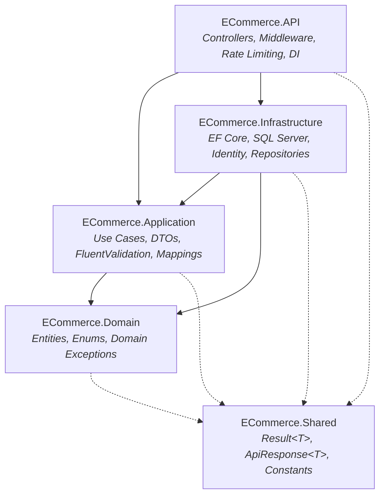

# 🛒 Enterprise E-Commerce Web API


A high-performance, enterprise-grade e-commerce RESTful Web API built with **.NET 9**, **C# 13**, and **Entity Framework Core 9**. Designed as a production-ready reference implementation demonstrating **Clean Architecture**, transactional consistency, optimistic concurrency control, finite state machines, and proactive zero-trust API security.

---

## 🏗️ System Architecture

The solution strictly enforces **Clean Architecture** (Onion Architecture). All dependencies point strictly inward toward the domain core, ensuring that business rules remain decoupled from database engines, web frameworks, and third-party infrastructure.



| Layer | Responsibility |
|---|---|
| **`ECommerce.Domain`** | Enterprise entities (`Product`, `Order`, `Cart`, `ApplicationUser`), domain enums (`OrderStatus`), and pure exceptions. Zero external dependencies. |
| **`ECommerce.Application`** | Business orchestration, service contracts (`IOrderService`, `ICartService`), DTO records, FluentValidation rules, and AutoMapper profiles. |
| **`ECommerce.Infrastructure`** | Database access (`AppDbContext`), EF Core configurations, generic `Repository<T>`, `UnitOfWork`, ASP.NET Core Identity, JWT generation, and file storage. |
| **`ECommerce.API`** | ASP.NET Core Web API host, routing, IP rate limiting, `ExceptionHandlingMiddleware`, and Swagger/OpenAPI security definitions. |
| **`ECommerce.Shared`** | Cross-cutting generic primitives (`Result<T>`, `ApiResponse<T>`) and system-wide constants. |

---

##  Hard Problems Solved

### 1. Flash-Sale Concurrency Control (Optimistic Locking)
* **The Problem:** Simultaneous checkout requests for the last remaining inventory item can cause over-selling (race conditions) if handled with standard read-modify-write patterns.
* **The Solution:** Implemented **Optimistic Concurrency Control** using SQL Server `rowversion` (`byte[] RowVersion`) on `Product`.
* **How It Works:** Stock is decremented within an atomic transaction. If two transactions read the same version, SQL Server awards the update to the first committer. The second transaction triggers a `DbUpdateConcurrencyException`, automatically rolls back, and returns an RFC 7807 `409 Conflict`. No database table locks or deadlock risks are incurred.

### 2. Zero-Trust Token Rotation & Intrusion Detection
* **The Problem:** Stolen refresh tokens allow attackers to maintain persistent unauthorized access.
* **The Solution:** Implemented **Refresh Token Rotation with Automatic Reuse Detection**.
* **How It Works:**
  * Every refresh request revokes the presented token and issues a new cryptographic pair.
  * **15-Second Grace Period:** Accommodates network latency and concurrent mobile requests by safely returning the active replacement token.
  * **Intrusion Revocation:** If an already-revoked token is submitted *after* the grace period, the system flags a replay attack and **immediately revokes all active refresh tokens for that user account**, forcing complete re-authentication.

### 3. Order Finite State Machine (FSM) & Stock Compensation
* **The Problem:** Uncontrolled order status modifications lead to invalid states (e.g., cancelling an order that was already delivered) and inventory discrepancies.
* **The Solution:** Enforced a strict state machine transition matrix:
  $$\text{Pending} \longrightarrow \text{Confirmed} \longrightarrow \text{Processing} \longrightarrow \text{Shipped} \longrightarrow \text{Delivered}$$
* **Stock Compensation:** Self-service and administrative cancellation is restricted to `Pending` and `Confirmed` statuses. Cancelling an order executes an atomic database transaction that automatically restores inventory quantities for every line item.

### 4. Tenant Isolation & IDOR Blinding
* **The Problem:** Insecure Direct Object References (IDOR) allow attackers to view or cancel other customers' orders by tampering with URL IDs.
* **The Solution:** User identity is extracted exclusively from cryptographically verified JWT claims (`ClaimTypes.NameIdentifier`). Queries strictly enforce `o.Id == orderId && o.UserId == currentUserId`. If an order belongs to another customer, the API returns **`404 Not Found`** (not `403 Forbidden`) to prevent resource enumeration.

### 5. 1:1 Shopping Cart Invariant
* **The Problem:** Separate cart creation creates race conditions and null-reference exceptions on customer onboarding.
* **The Solution:** A dedicated `Cart` entity is provisioned atomically during customer registration (and database seeding), guaranteeing that every customer always possesses exactly one persistent shopping cart.

### 6. RFC 7807 Standardized Error Contracts
* Centralized `ExceptionHandlingMiddleware` catches all downstream exceptions and maps them into uniform **RFC 7807 `ProblemDetails`** (`application/problem+json`). FluentValidation errors are automatically aggregated into strongly-typed property error dictionaries with distributed `traceId` logging.

---

## Technology Stack

| Category | Technologies & Patterns |
|---|---|
| **Framework & Language** | .NET 9.0, C# 13, ASP.NET Core Web API |
| **Architecture** | Clean Architecture (Onion / Hexagonal), Dependency Inversion Principle (DIP) |
| **Data & Persistence** | EF Core 9, SQL Server / LocalDB, Generic Repository & Unit of Work Patterns |
| **Security & Identity** | ASP.NET Core Identity, JWT Bearer (HS256), Refresh Token Rotation, HTTPOnly Cookies |
| **Validation & Mapping** | FluentValidation (Asynchronous Validators), AutoMapper 12 |
| **Traffic Control** | ASP.NET Core RateLimiting (Fixed-Window IP Partitions: 10 req/min & 100 req/min) |
| **Testing** | xUnit, FluentAssertions, NSubstitute, Microsoft.AspNetCore.Mvc.Testing |
| **API Documentation** | Swagger / OpenAPI with Bearer Security Scheme |

---

## API Surface (27 Endpoints)

| Module | Access | Key Endpoints | Description |
|---|---|---|---|
| **Auth** | Public / User | `POST /api/auth/register`<br/>`POST /api/auth/login`<br/>`POST /api/auth/refresh`<br/>`POST /api/auth/logout` | Authentication, 1:1 cart provisioning, token rotation, and cookie revocation. |
| **Categories** | Public / Admin | `GET /api/categories`<br/>`GET /api/categories/{id}`<br/>`POST` / `PUT` / `DELETE /api/categories/{id}` | Public taxonomy browsing and admin category management (with integrity delete protection). |
| **Products** | Public / Admin | `GET /api/products`<br/>`GET /api/products/{id}`<br/>`POST` / `PUT` / `DELETE /api/products/{id}`<br/>`POST` / `DELETE /api/products/{id}/images` | Paginated catalog search, price/category filtering, sorting, slug generation, and multipart image uploads. |
| **Cart** | Customer | `GET /api/cart`<br/>`POST /api/cart/items`<br/>`PUT /api/cart/items/{productId}`<br/>`DELETE /api/cart/items/{productId}`<br/>`DELETE /api/cart` | Real-time price change detection, stock validation, item line calculations, and cart clearance. |
| **Orders** | Customer | `POST /api/orders/checkout`<br/>`GET /api/orders`<br/>`GET /api/orders/{id}`<br/>`POST /api/orders/{id}/cancel` | Atomic transactional checkout, paginated history, IDOR-protected invoice details, and self-cancellation. |
| **Admin Orders** | Admin | `GET /api/admin/orders`<br/>`PUT /api/admin/orders/{id}/status` | Dashboard order inspection (status/date filters) and FSM state transition updates. |

---

## Getting Started (Zero-Friction Local Setup)

### Prerequisites
* [.NET 9.0 SDK](https://dotnet.microsoft.com/download/dotnet/9.0)
* **SQL Server LocalDB** (included with Visual Studio) or standard SQL Server instance

### 1. Clone & Run
The repository is pre-configured with default LocalDB connection strings and development keys for immediate out-of-the-box execution:

```bash
# Clone the repository
git clone https://github.com/Abdallah-Shadad/ecommerce-api.git
cd ecommerce-api

# Run the API (Applies schema and seeds initial data automatically)
dotnet run --project src/ECommerce.API
```

* **Swagger UI:** `https://localhost:7163/swagger` (or `http://localhost:5147/swagger`)

### 2. Seeded Test Accounts
On initial startup, `IdentitySeeder.cs` automatically provisions default roles, administrator credentials, and demo customers with active carts:

| Role | Email | Password |
|---|---|---|
| **Admin** | `abdallah.shadad@ecommerce.com` | `Admin123@` |
| **Customer** | `adel.emam@ecommerce.com` | `Customer123@` |

### 3. Interactive Testing (`ECommerce.API.http`)
Use the bundled [`src/ECommerce.API/ECommerce.API.http`](src/ECommerce.API/ECommerce.API.http) scratchpad in Visual Studio or VS Code REST Client to execute pre-configured requests with automated JWT token extraction for all workflows.

---

## Testing Suite

The solution contains comprehensive unit and full-pipeline integration tests:

```bash
dotnet test
```

```
Passed!  - Failed: 0, Passed: 20, Skipped: 0, Total: 20 - ECommerce.UnitTests.dll (net9.0)
Passed!  - Failed: 0, Passed:  1, Skipped: 0, Total:  1 - ECommerce.IntegrationTests.dll (net9.0)
```

* **Unit Tests (`ECommerce.UnitTests`)**: Tests isolated business logic (`OrderService`, `CartService`) with NSubstitute mocks and FluentAssertions, verifying stock deductions, concurrency exception handling, and FluentValidation rules.
* **Integration Tests (`ECommerce.IntegrationTests`)**: Uses `CustomWebApplicationFactory<Program>` to test full end-to-end customer lifecycles (Registration $\to$ Login $\to$ Cart $\to$ Atomic Checkout $\to$ Order Verification) against an in-memory test database.

---

## In-Depth Architectural Reference

For an exhaustive, didactic walkthrough of every layer, design pattern rationale, and line-by-line service flow:

👉 [**ECommerce_DeepDive_Architecture_And_Flow.md**](Docs/ECommerce_DeepDive_Architecture_And_Flow.md)
